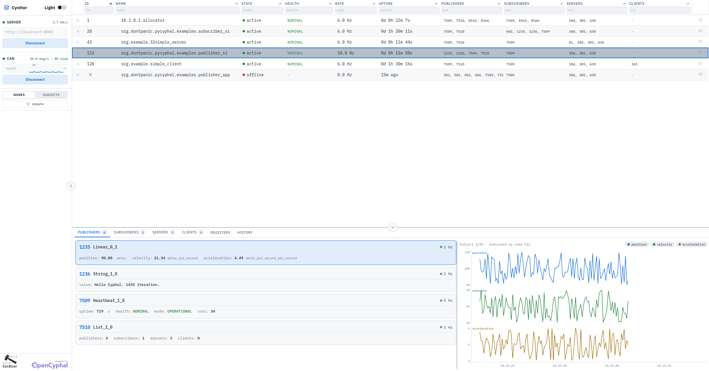

# Cynitor

A standalone dashboard for monitoring [Cyphal](https://opencyphal.org/) (UAVCAN) networks over CAN bus.

Cynitor watches the bus in real time, lists every node it discovers, and lets you drill into individual subjects to inspect message attributes and plot numeric values over time. GUI alternative to [yakut monitor](https://github.com/OpenCyphal/yakut).



## Quick Start

Cynitor has two parts that run independently: a Python backend that talks to the CAN interface, and a static-file frontend that runs in any modern browser.

### 1. Backend

```bash
cd server
pip install -r requirements.txt
python3 main.py --can vcan0     # connect to a known interface
# or
python3 main.py                  # pick the interface from the UI later
```

The HTTP server starts on `http://localhost:8080`.

### 2. Frontend

```bash
cd website
python3 -m http.server 5500
```

Open `http://localhost:5500` and click **Connect** in the sidebar.

## Features

- **Live node table** — sortable, filterable, with health, message rate, uptime, and per-row publisher/subscriber/server/client port lists. Pin favourites to the top with a star, hide offline nodes you don't care about.
- **Per-subject inspection** — click a node, then a subject card in the detail panel, to see live message attributes and a 60-second history.
- **Multi-attribute plots** — each numeric attribute gets its own panel with its own y-axis, so a fast-growing uptime doesn't squash a small voltage reading. Toggle pills at the top of the plot show/hide individual attributes.
- **Hover crosshair + tooltip** with timestamp and per-series values at the cursor.
- **Dark / light theme**, sidebar collapse, resizable detail panel.
- **Auto-reconnect** on transient backend or frontend-server outages.
- **Persisted layout** — connection state, table sort, column widths, filters, theme, panel sizes all restored on reload from `localStorage`.

## Setup Modes

| Mode | Command | When to use |
|------|---------|-------------|
| Direct | `python3 main.py --can vcan0` | You know the interface and want CAN running on launch |
| Selection | `python3 main.py` | You want to pick the interface from the UI dropdown |

In selection mode the HTTP server starts immediately, but pycyphal is not initialized until the user posts to `/api/can/connect`. The same UI flow lets you disconnect and reconnect to a different interface without restarting the backend. Pass `--recompile` to force `nnvg` to regenerate compiled DSDL Python from `dsdl_messages/`.

## Troubleshooting

**"Frontend Server Unavailable" overlay appears.** The static-file server on port 5500 stopped responding. Restart it with `cd website && python3 -m http.server 5500`. Cynitor reloads automatically once it's back.

**Backend won't connect to CAN.** Check that the interface exists (`ip link show vcan0`) and that you have permission to open it. If `yakut accommodate` fails, the backend logs a warning but still starts — the node ID just won't be auto-assigned. Check `/api/logs` or stderr for the full error.

**No nodes appearing.** Confirm there are publishers on the bus (`yakut sub uavcan.node.Heartbeat.1.0`). On a virtual interface (`vcan0`) you also need a publisher on the same `vcan` interface — the backend doesn't generate traffic on its own.

**Port 5500 in use.** Run `python3 -m http.server 8088` (or any free port) and open the matching URL.

## Documentation

- **[TECHNICAL.md](TECHNICAL.md)** — Architecture, component breakdown, data flow, project structure, extension points.
- **[WEBSOCKET_README.md](WEBSOCKET_README.md)** — Full REST + WebSocket API contract.
